# Final Project!

## Milestone 1: Project planning (due 11/15)

#### Introduction

My final project is motivated by a Chinese painting of some horses by an artist named 徐悲鴻 (Xu Beihong) that was in my house when I was growing up as a kid. It is also inspired by Grace’s Watercolor Shader that was demoed as an example of a final project from past years, which I thought was really cool. I think it would be cool to be able to take an SDF scene and recreate it into a stylized version that is similar to that of an ink painting.

#### Goal

Create a shader in WebGL that takes in an SDF scene and stylizes the appearance of the geometry to make it look like a traditional Chinese ink painting. Specifically will create a horse SDF scene to mimic the inspiration paintings.

#### Inspiration/reference:

Picture of the painting at home:

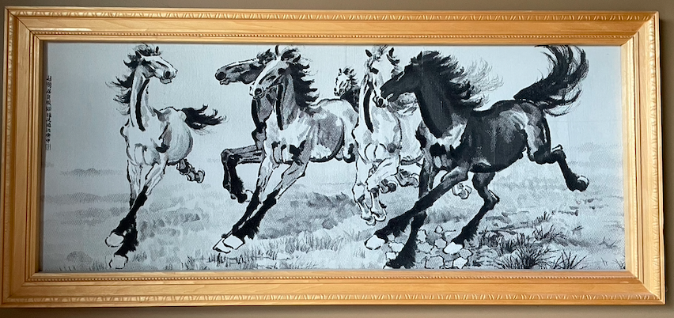

Picture of just one horse by same artist:

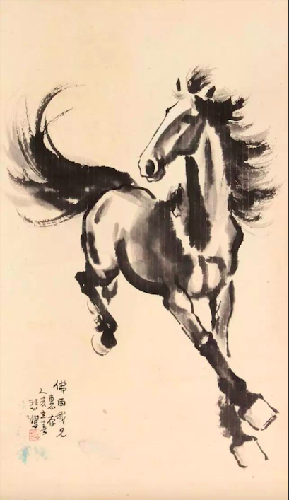

References:

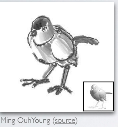

- Color Slides (https://cis566-procedural-graphics.github.io/color.pdf)
- Hatching GLSL (https://www.youtube.com/watch?v=ml9v8PZ5j10&ab_channel=helloworld)
- NPR Rendering (https://www.youtube.com/watch?v=gT9qU_fJNuw&ab_channel=ChrisKnott)
- NPR Example Shader (https://www.shadertoy.com/view/MscSzf)
- NPR Paper (https://www.researchgate.net/publication/236973460_Non-Photorealistic_Rendering)
- Watercolor Shader (https://github.com/gracelgilbert/watercolor-stylization)

#### Specification:
- Ink Shader
- User Input
  - Change intensity of color bleeding
  - Change intensity of edge darkening
  - Change intensity of hand tremors

#### Techniques:
- Raymarching
  - Main method to render scene by marching rays along scene until running into objects
- SDFs
  - Used to determine the ray's distance between objects in the scene
- Noise Functions
  - Used to displace vertices to mimic the effect of a brush stroke 
- Color Bleeding
  - Used to mimic the effect of the ink bleeding on the page by directly deforming the geometry using noise
- Edge Darkening
  - Taking the difference of the Gaussian blur of the image and the regular image and exponentiating it to darken the edges
- Gaussian Blur
  - To add a smear effect in some portions of the scene 

#### Design:

#### Timeline:
Week 1: Create main SDF scene with basic shading

Week 2: Create vertex shader and fragment shader that create the ink painting effect

Week 3: Fine tune details, can add basic elements to background

## Milestone 2: Implementation part 1 (due 11/22)

So far, I am a bit behind in terms of my project goals mainly because last week was quite busy for me. Conceptually the SDF modeling of the scene is not too difficult for me since I have done it before in the homeworks, but fine tuning the parameters still takes a while.

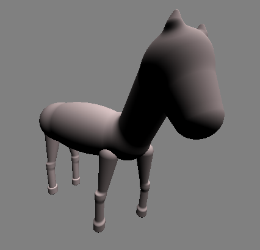

## Milestone 3: Implementation part 2 (due 11/29)

Implemented a toon shading effect mixed with some FBM noise to shade in the horse SDF model. Also added geometry for the mane and tail and also added a displacement function to distort the geometry a bit to create a more natural feel. Still need to improve the shader to make it look more ink like, and also need to add user input in order to generate variations of the same horse by changing the base color, changing limb length, changing the angle of the legs, etc.. Will prioritize adding features to generate variations of the horse model for the final deadline.

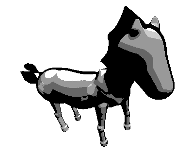

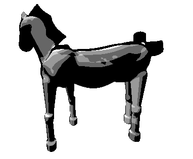

## Final submission (due 12/6)
Time to polish! Spen this last week of your project using your generator to produce beautiful output. Add textures, tune parameters, play with colors, play with camera animation. Take the feedback from class critques and use it to take your project to the next level.

Submission:
- Push all your code / files to your repository
- Come to class ready to present your finished project
- Update your README with two sections 
  - final results with images and a live demo if possible
  - post mortem: how did your project go overall? Did you accomplish your goals? Did you have to pivot?

Live Demo: (In Progress)

Resulting Images:

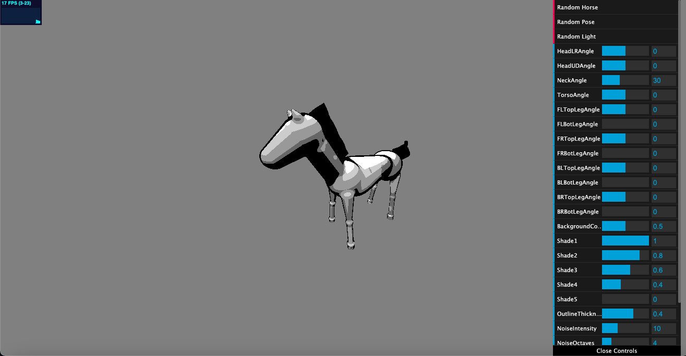

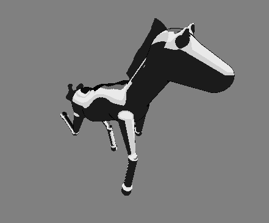

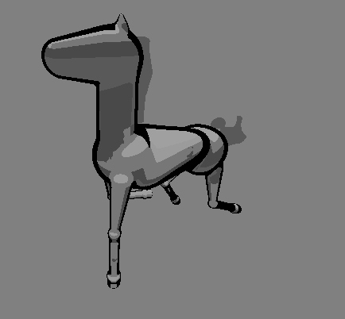

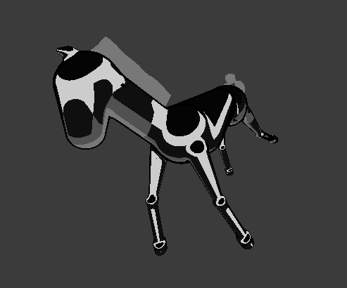

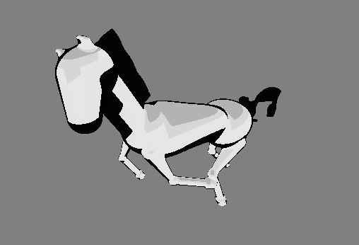

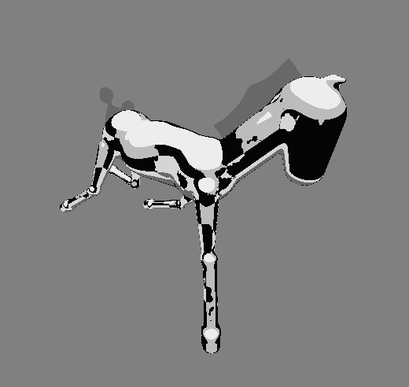

### Post Mortem

Overall I would say I am fairly happy with how my project turned out, although it ended up being quite different then what I wanted to do with it going into things. I think this is mainly because I was still a bit vague of what I wanted to accomplish with my project because I wasn't sure how to implement all of the 
ideas I wanted to do. I'm happy that I ended up with a type of horse generator with non-photorealistic shading, but I definitely could have done a better job with the shader. The main thing that changed was that I was initially planning to make a shader that replicated the elements of a Chinese ink painting, but in the end when I tried replicated those elements I ended up using toon shading with FBM noise, which I ended up liking and sticking with. From there, I added 
elements to the GUI to allow users to change the pose of the SDF horse model, adjust the colors of the toon shading, adjust the noise used in the toon shading, move the light, as well as be able to generate random horses that essentially randomize the elements stated above. In terms of things I could work on in the future for this project, I would definitely add more customization in terms of the body of the model (like adjusting leg length, body width, etc.), as well as work on the shader more to make it more interesting and more visually accurate of what I wanted to do with the project in the first place.
